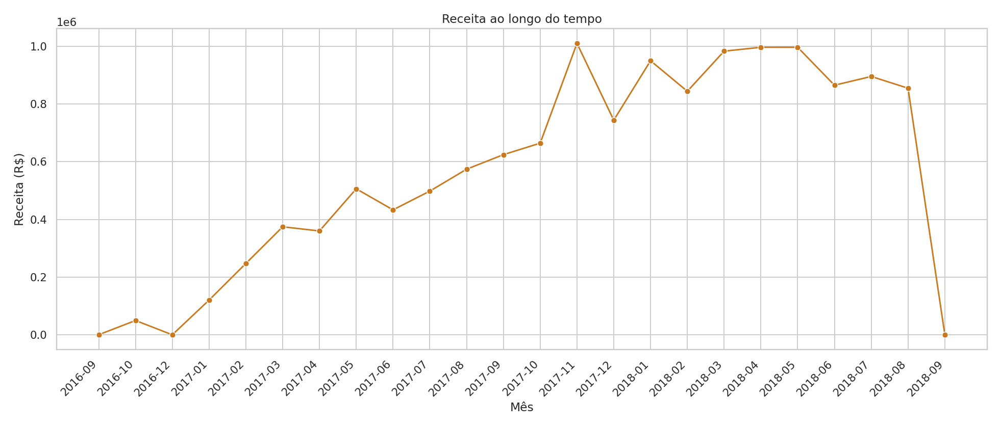
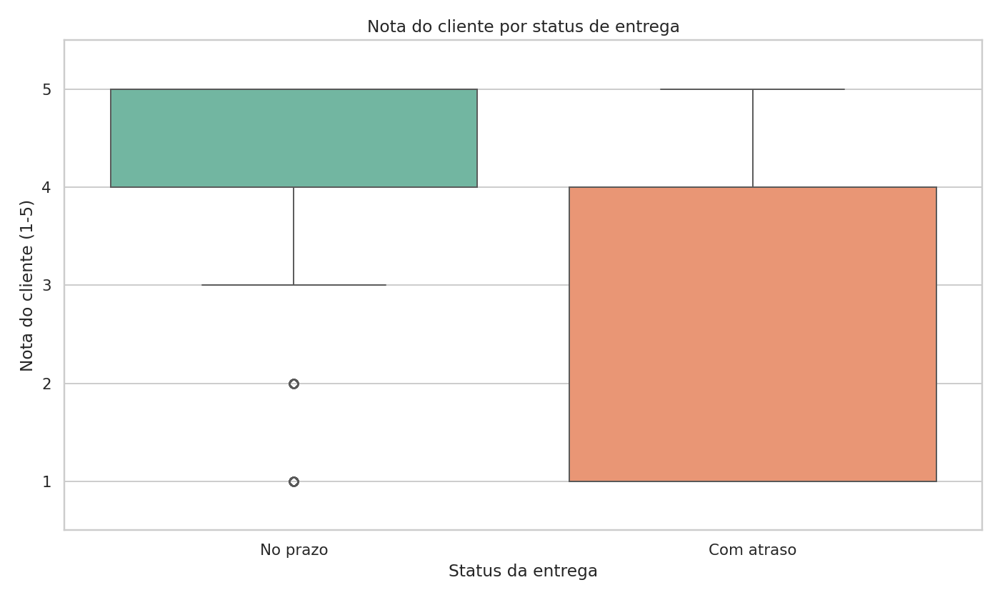
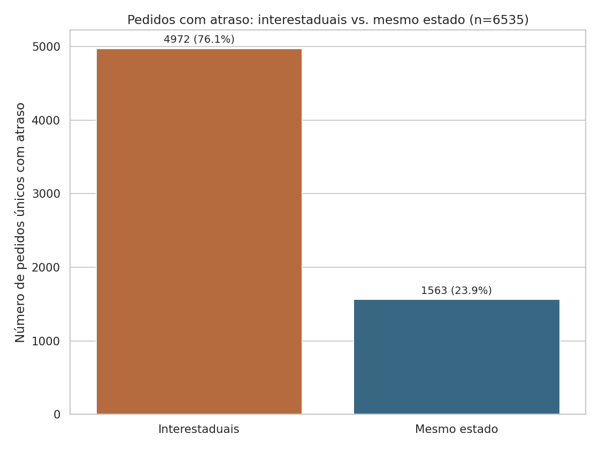
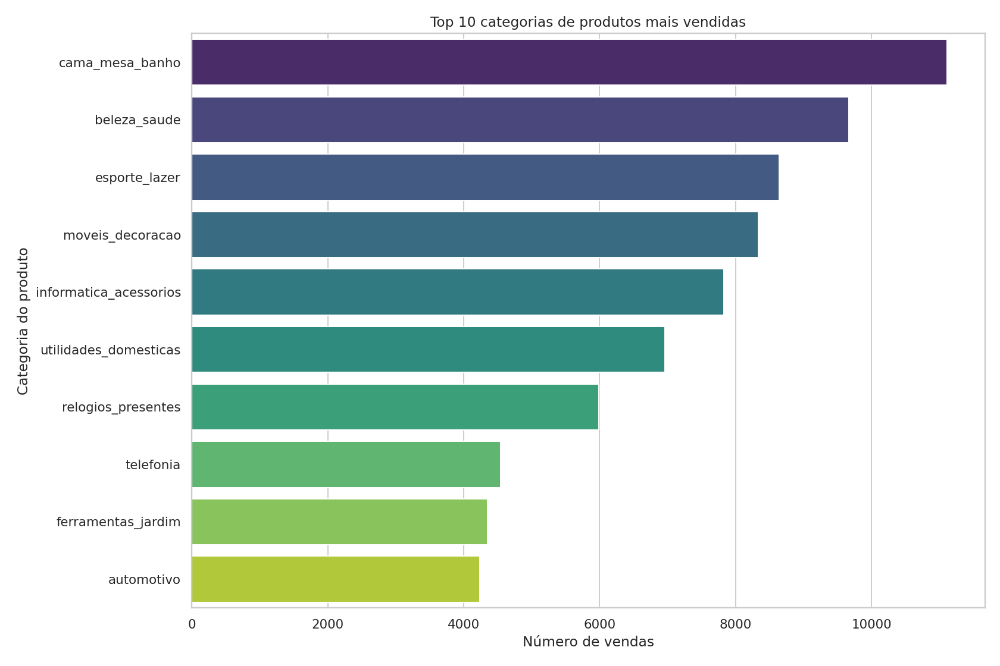

# 📊 Análise de Vendas — Marketplace Olist

Análise exploratória de dados de um marketplace brasileiro real, cobrindo ~100 mil pedidos entre 2016 e 2018: evolução de vendas, categorias mais vendidas, impacto do prazo de entrega na satisfação do cliente, atrasos interestaduais e perfil de pagamento.

**Autor:** Lucas Menezes — Engenheiro Mecânico & Analista de Dados
[GitHub](https://github.com/L-menezess) · [LinkedIn](https://www.linkedin.com/in/lucasmenezess/)

---

## 🎯 Objetivo

Responder, com dados, perguntas de negócio típicas de um e-commerce:

1. Como evoluíram pedidos e receita ao longo do tempo?
2. Quais categorias de produto mais vendem?
3. O prazo de entrega afeta a nota que o cliente dá ao pedido?
4. Atrasos se concentram em transações interestaduais?
5. Qual o perfil do cliente — localização, forma de pagamento e satisfação por estado?

## 🛠️ Ferramentas

`Python` · `Pandas` · `Seaborn` / `Matplotlib` · `Jupyter Notebook`

## 📁 Estrutura do repositório

```
projeto-olist/
├── notebooks/
│   └── analise_vendas_olist.ipynb   # notebook completo, com gráficos e conclusões
├── scripts/
│   └── gerar_graficos.py            # versão em script (.py) da mesma análise
├── images/                          # gráficos exportados em PNG
├── data/                            # dataset (ver instruções de download abaixo)
├── requirements.txt
└── README.md
```

## 📥 Dataset

Este projeto usa o [Brazilian E-Commerce Public Dataset by Olist](https://www.kaggle.com/datasets/olistbr/brazilian-ecommerce), disponível publicamente no Kaggle. Os arquivos CSV não estão versionados neste repositório (dataset grande, ~80 MB). Para reproduzir a análise:

1. Baixe o dataset no link acima
2. Extraia os arquivos `.csv` para a pasta `data/`
3. Rode o notebook em `notebooks/`

## 📈 Principais insights

**Crescimento consistente, com pico sazonal**
Pedidos e receita cresceram de forma quase contínua entre 2016 e 2018, com pico em novembro/2017 (Black Friday).



**Prazo de entrega é o maior driver de satisfação**
A nota média do cliente cai de **4,28 para 2,25** quando o pedido chega atrasado — o maior impacto identificado em toda a análise.



**Frete interestadual concentra o risco de atraso**
**76%** dos pedidos atrasados envolvem comprador e vendedor em estados diferentes.



**Categorias líderes em vendas**
`cama_mesa_banho`, `beleza_saude` e `esporte_lazer` lideram em volume — bons candidatos a campanhas e priorização de estoque.



> Notebook completo com todas as análises (incluindo perfil de pagamento e satisfação por estado): [`notebooks/analise_vendas_olist.ipynb`](notebooks/analise_vendas_olist.ipynb)

## ▶️ Como rodar localmente

```bash
git clone https://github.com/L-menezess/projeto-olist.git
cd projeto-olist
pip install -r requirements.txt
jupyter notebook notebooks/analise_vendas_olist.ipynb
```

---
⭐ Se este projeto foi útil ou interessante, deixe uma estrela no repositório.
